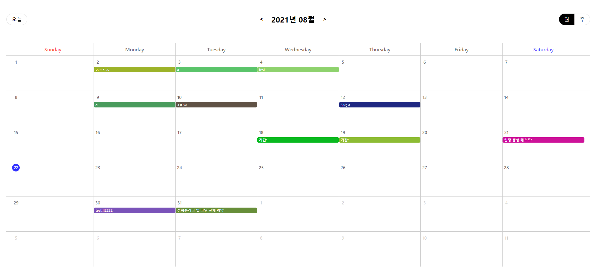

# 리액트 캘린더 일정 관리 프로젝트


## 개발환경
* Windows 10
* [Nodejs 16.6.2](https://nodejs.org/ko/)
* [Docker Desktop for Windows](https://hub.docker.com/editions/community/docker-ce-desktop-windows/)
  - Engine v20.10.7
  - docker-compose v1.29.2
* Webstorm

## 기술스택
* DB
  - Postgresql (by Docker)
    > 일정 저장을 위한 DBMS 구성. 로컬에서 쉽고 빠르게 구성할 수 있는 Docker 사용
* Backend
  - nodejs express
    > 일정 조회, 등록, 수정, 삭제를 위한 API 서버 구성
  - [sequelize (ORM)](https://sequelize.org/master/)
    > DBMS 종속성이 적은 ORM 사용
* Frontend
  - [CRA (Create React App)](https://github.com/facebook/create-react-app)
    > 리액트 템플릿 초기 셋팅 (npx create-react-app calendar-scheduling --template typescript)
  - React
    > 컴포넌트 단위 개발로 인한 재사용성이 뛰어남
  - typescript
    > 정적 타입 분석으로 인한 에러 방지
  - [recoil](https://recoiljs.org/ko/)
    > 상태관리 라이브러리. React hooks 개념과 유사해서 사용 편리함.
     
* [Yarn Workspaces](https://classic.yarnpkg.com/en/docs/workspaces/)
  > NPM 7.x 이상 부터 workspace 를 지원하지만 조금 더 넓은 NPM 버전을 지원하는 yarn 을 사용
  > 
  > 백엔드와 프론트엔드의 의존성을 프로젝트 Root 에서 한번에 설치

## 필수설치 소프트웨어
* Git
* Nodejs
* Docker
* Docker Compose

## 패키지구조 
```
├── packages                        # 전체 패키지 폴더
│   ├── client                      # 프론트엔드 패키지
│   │   ├── public                  # public 
│   │   ├── src                     # 
│   │   │   ├── components          # UI 컴포넌트
│   │   │   │   ├── button          ## 버튼
│   │   │   │   ├── calendar        ## 달력
│   │   │   │   ├── dialog          ## 다이얼로그 
│   │   │   │   ├── formControl     ## input select 박스
│   │   │   │   └── grid            ## 그리드(list)
│   │   │   ├── hooks               # 커스텀 훅
│   │   │   ├── pages               # 페이지 컨테이너
│   │   │   ├── service             # 백엔드 요청
│   │   │   ├── states              # recoil 상태관리 객체
│   │   │   └── utils               # 자주 사용하는 유틸 함수
│   ├── server                      # 백엔드 패키지
│   │   ├── config                  # 설정 파일 (db connection 정보 및 winston 설정)
│   │   ├── routes                  # 라우트
│   │   │   ├── api                 #
│   │   │   └──   └─ schedule       ## 일정관리 api 컨트롤러
│   │   └── sequelize               # 시퀄라이즈 설정 및 model 정의
├── docker-compose.yml              # postgresql docker compose
└── README.md                       # md
```

## 설치
```shell
git clone https://github.com/sbjang123456/calendar-scheduling.git
cd calendar-scheduling
docker-compose up -d
npm install -g yarn
yarn
```

## 구동
```
yarn dev
```
